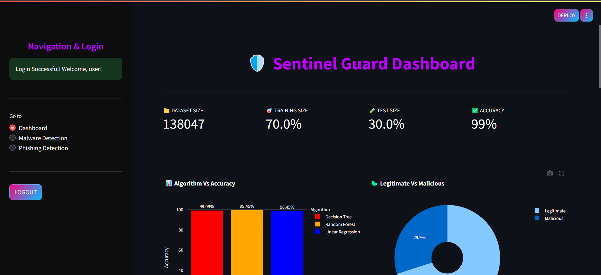
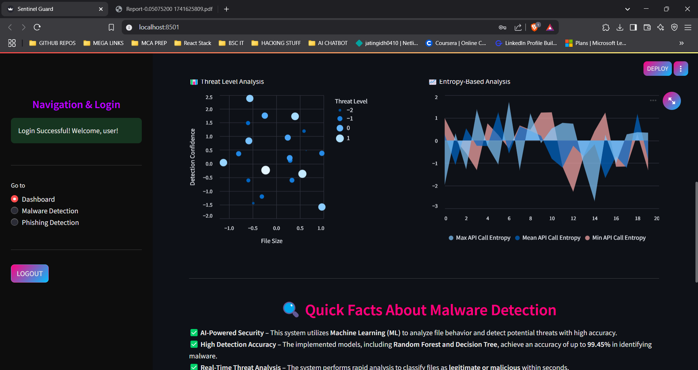
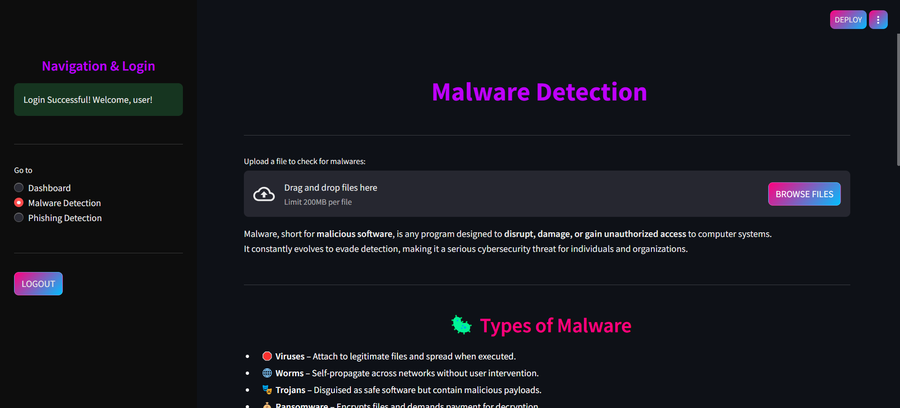
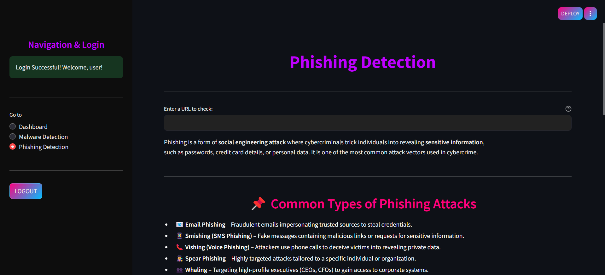

# 🛡️ SentinelGuard – AI-Powered Cybersecurity

SentinelGuard is an advanced cybersecurity solution that uses machine learning (ML) and artificial intelligence (AI) to detect and prevent malware and phishing threats in real-time. Built to tackle modern cyber threats, SentinelGuard provides automated threat detection, risk assessment, and security insights to enhance digital security.

## 🚀 Features

- **Real-Time Malware Detection** – Upload files and analyze them using AI-powered models.
- **Phishing URL Analysis** – Detects phishing attempts using ML-based URL analysis.
- **Interactive Dashboard** – View threat insights, risk reports, and security analytics.
- **User Authentication** – Secure login system to protect access.
- **AI-Powered Decision Making** – Automated malware classification with high accuracy.

## 📂 How to Set Up and Run

### 1️⃣ Clone the Repository

```sh
git clone https://github.com/jatingidh0410/Sentinel_Guard.git  
cd Sentinel_Guard  
```

### 2️⃣ Create a Virtual Environment for Streamlit

```sh
python -m venv streamlit_env  
source streamlit_env/bin/activate  # On macOS/Linux  
streamlit_env\Scripts\activate     # On Windows  
```

### 3️⃣ Install Dependencies

```sh
pip install -r requirements_new.txt  
```

### 4️⃣ Create a "malwares" Folder

To test SentinelGuard, create a folder named `malwares` in the project directory and upload malware samples for analysis.

### 5️⃣ Login Credentials

```
Username: admin
Password: admin
```

You can change the credentials in `.streamlit/secrets.toml`

### 6️⃣ Run the Application

```sh
streamlit run main.py  
```

Then, open the browser to [http://localhost:8501/](http://localhost:8501/) and start detecting threats!

## 📸 Screenshots






## 🔧 Future Enhancements

- Deep Learning Models for improved malware detection.
- Threat Intelligence Integration with global cybersecurity databases.
- Cloud & Mobile Support for broader accessibility.

## 👨‍💻 Contributing

Want to improve SentinelGuard? Feel free to fork the repo, create a branch, and submit a pull request!
